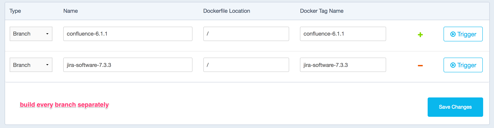

# docker-atlassian-base-images

Base Images of Atlassian Software used in other Images based on Alpine Linux with Oracle JDK 8.

Used by:

 * [docker-atlassian-confluence-data-center](https://github.com/codeclou/docker-atlassian-confluence-data-center)
 * [docker-atlassian-jira-data-center](https://github.com/codeclou/docker-atlassian-jira-data-center)

-----

&nbsp;

### Usage

You can extend from such a base image in your `Dockerfile` like so:

 * **[confluence-6.1.1](https://github.com/codeclou/docker-atlassian-base-images/blob/confluence-6.1.1/Dockerfile)**
   * `FROM codeclou/docker-atlassian-base-images:confluence-6.1.1`
 * **[jira-software-7.3.3](https://github.com/codeclou/docker-atlassian-base-images/blob/jira-software-7.3.3/Dockerfile)**
   * `FROM codeclou/docker-atlassian-base-images:jira-software-7.3.3`

See the Dockerfiles here for internal structure. Basically all images have the following structure:

 * `/confluence/` = where Confluence is extracted to
 * `/confluence-home/` = Confluence Home
 * `/confluence-shared-home/` = Confluence Shared Home for Confluence Data Center
 * User `worker` with UID and GID 10777 is created and all files and dirs are owned by him
 * `/work` can be used as Volume when inspecting container to exchange data
 * `/work-private` can be used to place files like docker-entrypoint.sh and other configs.
 * shinto-cli is installed, so that you can run `env | j2 myscript.sh.jinja2 > myscript.sh`
 * Symlink is created so that install dir can be accessed like so `/confluence/atlassian-confluence-latest/bin/catalina.sh`

-----

&nbsp;

### Docker Hub Build Settings

-----

&nbsp;

### Trademarks and Third Party Licenses

 * **Atlassian JIRA® Sofware**
   * Atlassian®, Confluence®, JIRA®, JIRA® Software are registered [trademarks of Atlassian Pty Ltd](https://de.atlassian.com/legal/trademark).
   * Please check yourself for corresponding Licenses and Terms of Use at [atlassian.com](https://atlassian.com).
 * **Oracle Java JDK 8**
   * Oracle and Java are registered [trademarks of Oracle](https://www.oracle.com/legal/trademarks.html) and/or its affiliates. Other names may be trademarks of their respective owners.
   * Please check yourself for corresponding Licenses and Terms of Use at [www.oracle.com](https://www.oracle.com/).
 * **Docker**
   * Docker and the Docker logo are trademarks or registered [trademarks of Docker](https://www.docker.com/trademark-guidelines), Inc. in the United States and/or other countries. Docker, Inc. and other parties may also have trademark rights in other terms used herein.
   * Please check yourself for corresponding Licenses and Terms of Use at [www.docker.com](https://www.docker.com/).
 * **PostgreSQL**
   * PostgreSQL is a [registered trademark of the PostgreSQL Community Association of Canada](https://wiki.postgresql.org/wiki/Trademark_Policy).
   * Please check yourself for corresponding Licenses and Terms of Use at [www.postgresql.org](https://www.postgresql.org/).
 * **Ubuntu**
   * Ubuntu and Canonical are registered [trademarks of Canonical Ltd.](https://www.ubuntu.com/legal/short-terms)
 * **Apple**
   * macOS®, Mac and OS X are [trademarks of Apple Inc.](http://www.apple.com/legal/intellectual-property/trademark/appletmlist.html), registered in the U.S. and other countries.

-----

&nbsp;

### License

[MIT](./LICENSE) © [Bernhard Grünewaldt](https://github.com/clouless)
